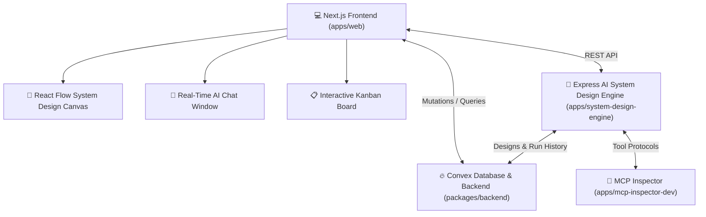

# Advanced System Design Automation Monorepo

Welcome to the **System Design Automation Template**—a state-of-the-art, high-performance, and enterprise-grade monorepo designed to build and manage system design diagrams and architectures. This template combines modern UI canvas editors with stateful AI runtimes, real-time streaming, secure multi-tenant authentication, and event-driven architecture.

[](https://nextjs.org/)
[](https://react.dev/)
[](https://convex.dev/)
[](https://tailwindcss.com/)
[](https://pnpm.io/)
[](https://clerk.com/)

---

## 🏗️ Architecture & Component Overview

This repository is powered by a high-performance **pnpm Workspace** monorepo structure, optimizing dependency sharing, code caching, and build tasks across multiple independent applications and packages.



### 📱 Applications (`/apps`)

| App Directory                                                                                 | Core Technologies                                                                   | Description                                                                                                                                                                                                                                                            |
| :-------------------------------------------------------------------------------------------- | :---------------------------------------------------------------------------------- | :--------------------------------------------------------------------------------------------------------------------------------------------------------------------------------------------------------------------------------------------------------------------- |
| [**`apps/web`**](file:///d:/ai/yt/pro/blueprint/apps/web)                             | Next.js 16, React 19, Tailwind v4, `@xyflow/react`, Clerk, Framer Motion            | **Interactive Frontend Canvas & App Portal**: Multi-tenant protected user portal with workspace folders, interactive drag-and-drop system design builder using React Flow, embedded agent chat panel with thinking states, Kanban task manager, and API Key administration. |
| [**`apps/system-design-engine`**](file:///d:/ai/yt/pro/blueprint/apps/system-design-engine)     | Express.js, `@langchain/langgraph`, LangChain Core, MCP SDK | **High-Performance AI Execution Server**: Computes system design analysis using LangGraph state machines, coordinates node operations (LLMs, API webhooks, MCP tools), runs custom API limiters.                          |
| [**`apps/mcp-inspector-dev`**](file:///d:/ai/yt/pro/blueprint/apps/mcp-inspector-dev) | `@modelcontextprotocol/inspector`                                                   | **MCP Dev & Verification Console**: Interactive tool interface enabling swift validation and testing of Model Context Protocol configurations.                                                                                                                         |

### 📦 Packages (`/packages`)

| Package Directory                                                                                     | Description                                                                                                                                                                            |
| :---------------------------------------------------------------------------------------------------- | :------------------------------------------------------------------------------------------------------------------------------------------------------------------------------------- |
| [**`packages/backend`**](file:///d:/ai/yt/pro/blueprint/packages/backend)                     | **Core Database & Mutation Layer**: Holds the complete Convex backend schemas, database indexes, Clerk auth webhook integrations, API Key validators, and Creem subscription managers. |
| [**`packages/ui`**](file:///d:/ai/yt/pro/blueprint/packages/ui)                               | **Shared Design System**: Reusable React component package built using Tailwind CSS v4 and shadcn/ui primitives.                                                                       |
| [**`packages/eslint-config`**](file:///d:/ai/yt/pro/blueprint/packages/eslint-config)         | Monorepo-wide code style configurations.                                                                                                                                               |
| [**`packages/typescript-config`**](file:///d:/ai/yt/pro/blueprint/packages/typescript-config) | Monorepo-wide strict TypeScript compiler settings.                                                                                                                                     |

---

## 🌟 Key Features

1. **Visual Drag-and-Drop System Design Canvas**
   - Built on top of **React Flow (`@xyflow/react`)** for beautiful, fluid layouts.
   - Design custom node configurations for cloud infrastructure, databases, and microservices.
   - Draw logical custom edge bindings for data flow and networking.

2. **Durable LangGraph AI Agent Execution**
   - Stateful multi-step graph nodes running inside the `system-design-engine`.
   - Native integration with LLM providers (Google Gemini, Groq, etc.).
   - Support for **Model Context Protocol (MCP)** standard tools, letting your agent inspect databases, query systems, or execute scripts securely.

3. **Robust Database & Billing System**
   - Built using **Convex**, providing rapid real-time reactive queries and guaranteed atomic database mutations.
   - Secure and scalable **Clerk** multi-tenant authentication integration.
   - Fully loaded subscription tier manager leveraging **Creem billing** integration.

---

## 🚀 Quick Start Guide

### 1. Prerequisites

Ensure you have the following installed on your developer workspace:

- **Node.js** >= 20.0
- **pnpm** >= 10.4.1

### 2. Configure Environment Variables

You'll need to configure variables for each layer. Create copies of the provided examples:

#### For `packages/backend/.env.local`:

```bash
CONVEX_DEPLOYMENT=your-convex-deployment-url
CLERK_SECRET_KEY=your-clerk-secret
CLERK_JWT_ISSUER_DOMAIN=your-clerk-domain
CREEM_API_KEY=your-creem-key
```

#### For `apps/system-design-engine/.env`:

```bash
PORT=3001
CORS_ORIGIN=http://localhost:3000
CONVEX_URL=your-convex-deployment-url
SYSTEM_CORE_SECRET=your-internal-secret
GEMINI_API_KEY=your-gemini-api-key
GROQ_API_KEY=your-groq-api-key
```

### 3. Install Dependencies

Run the following at the root of the workspace:

```bash
pnpm install
```

### 4. Running the Development Ecosystem

This template uses **Turborepo** to orchestrate all services simultaneously:

```bash
pnpm dev
```

This single command spins up:

- Next.js web application (`http://localhost:3000`)
- AI Express Server / System Design Engine (`http://localhost:3001`)
- MCP Inspector UI Console

---

## 🛠️ Developer Commands

Here are the primary scripts defined in the root `package.json`:

- **Start Dev Services**: `pnpm dev`
- **Production Build**: `pnpm build`
- **Lint Files**: `pnpm lint`
- **Format Project**: `pnpm format`
- **Run Unit/Integration Tests**: `pnpm test`
- **E2E Browser Testing**: `pnpm test:e2e`

---

## 🧪 Testing Guidelines

This template supports multi-tier testing workflows built into the CI/CD structure:

- **Unit & Integration Testing**: Powered by **Vitest** for instant feedback loops. Add files ending in `.test.ts` or `.spec.ts`.
- **End-to-End Visual Testing**: Built using **Playwright** inside `apps/web/e2e/` to test complex UI states, auth flows, and React Flow canvases.

To run tests within the Next.js app:

```bash
# From apps/web
pnpm test
pnpm test:e2e
```

---

## 🎨 Managing shadcn/ui Components

The shared component library resides inside `packages/ui`. To add new components to the shared package, run the shadcn CLI relative to your workspace target:

```bash
pnpm dlx shadcn@latest add button -c apps/web
```

This places the component into the common directory `packages/ui/src/components/ui/` ready to be imported across pages!

Import in your Next.js application like so:

```tsx
import { Button } from "@workspace/ui/components/button";
```

---

## 📜 License

This project is private and proprietary. All rights reserved. Created by Subhash Nayak.
